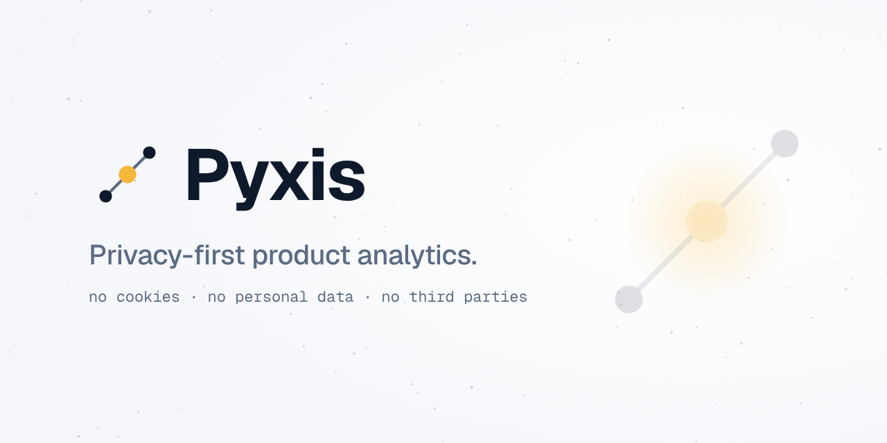
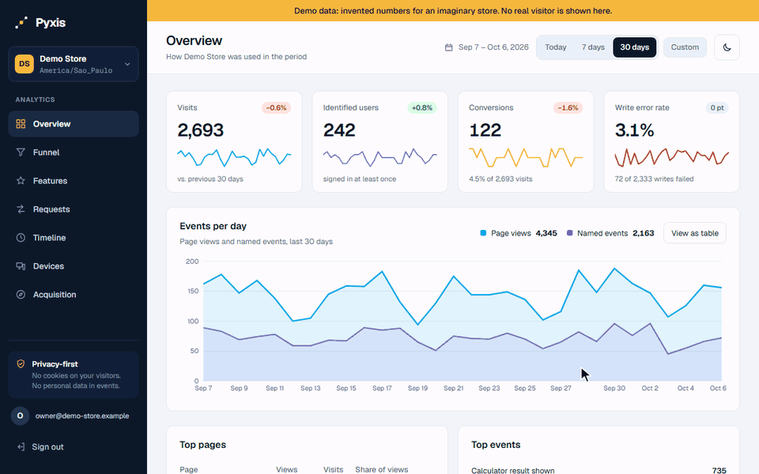
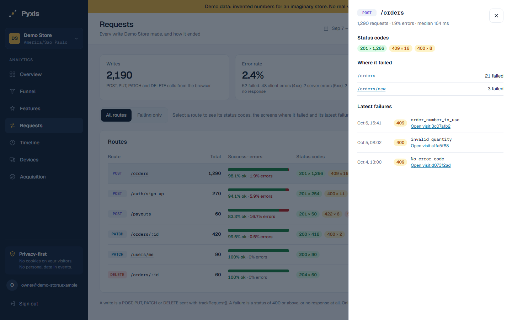
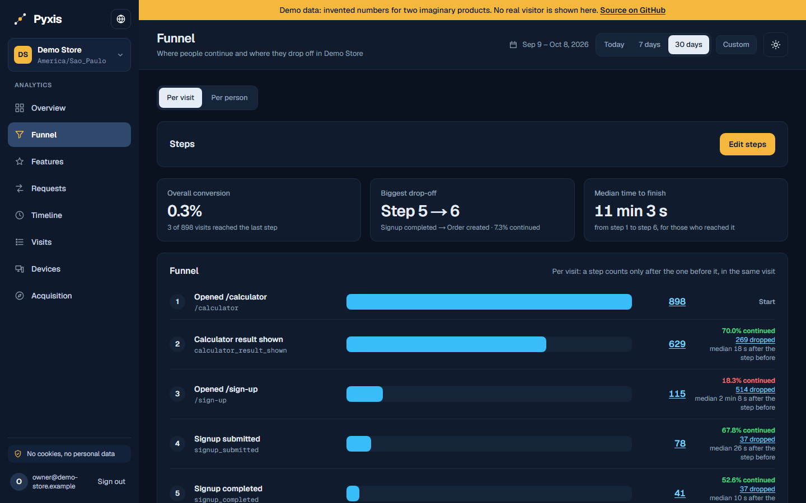
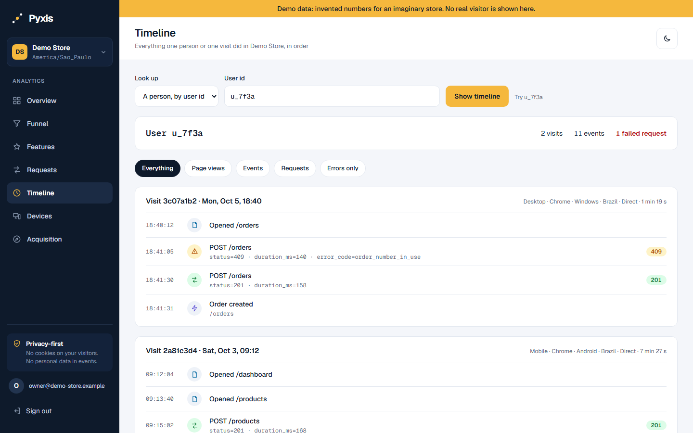
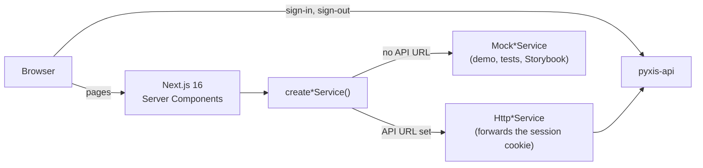

<div align="center">

<picture>
  <source media="(prefers-color-scheme: dark)" srcset=".github/assets/cover-dark.png">
  
</picture>

**The dashboard of Pyxis: the overview, funnels, features, request errors, devices, acquisition and
per-person timelines of a product, measured without cookies or personal data.**

[](https://github.com/samuelcsantana/pyxis-web/actions/workflows/ci.yml)
[](https://codecov.io/gh/samuelcsantana/pyxis-web)
[](https://github.com/samuelcsantana/pyxis-web/actions/workflows/codeql.yml)
<br>
[](LICENSE)
[](tsconfig.json)
[](https://www.conventionalcommits.org)
[](e2e)
[](https://samuelcsantana.github.io/pyxis-web/)
[](https://demo.pyxis.samuelsantana.dev)

**[Live demo](https://demo.pyxis.samuelsantana.dev)** ·
**[Storybook](https://samuelcsantana.github.io/pyxis-web/)** ·
**[API reference](https://samuelcsantana.github.io/pyxis-api/)** ·
**[SDK playground](https://samuelcsantana.github.io/pyxis-sdk/)**

</div>



| Requests, with a route's details                                                                                                                                                                      | Funnel, dark theme                                                                                                                                 | Timeline of one person                                                                                                                           |
| ----------------------------------------------------------------------------------------------------------------------------------------------------------------------------------------------------- | -------------------------------------------------------------------------------------------------------------------------------------------------- | ------------------------------------------------------------------------------------------------------------------------------------------------ |
|  |  |  |

The tour and the screenshots show invented demo data: the dashboard runs on it when no API is
configured. The tour was recorded from the [live demo](https://demo.pyxis.samuelsantana.dev).

> **Status:** early development, in production. Every screen works against the API, deployed at
> `pyxis.samuelsantana.dev` for the projects' admins, and against invented data in the public
> [live demo](https://demo.pyxis.samuelsantana.dev).

## Ecosystem

| Repository                                               | Role                                                         |
| -------------------------------------------------------- | ------------------------------------------------------------ |
| [pyxis-api](https://github.com/samuelcsantana/pyxis-api) | Ingestion, dashboard sign-in and queries, erasure, retention |
| [pyxis-sdk](https://github.com/samuelcsantana/pyxis-sdk) | Browser tracker published to npm as `pyxis-analytics`        |
| **pyxis-web** (this one)                                 | The dashboard                                                |

## Why it exists

A product team wants to know which features are used, where requests fail, where a sign-up funnel
loses people and what one person did, in order. Pyxis answers those questions from events that
carry no cookie, no IP address and no personal data. This dashboard is where the answers are read:
one admin, one email code to sign in, and a design that puts the number that matters first.

## Features

Shipping now:

- The approved brand and design tokens (light and dark), exposed to Tailwind CSS 4
- A strict Content Security Policy and hardening headers on every page
- Storybook with the design tokens page, a page of every control recipe (primary, strong,
  secondary and icon buttons, segmented options, tabs, pills, links, fields) at rest, hovered,
  pressed, focused, unavailable and busy, and stories for those states; the open, busy and failed
  states of the shell (project switcher, Custom period, phone menu, Sign out) and the app's own
  empty pages under "Pages/States"; every story is also an automated accessibility test
- Every control answers the pointer and a tap: hover and pressed states of at least 1.3:1 in both
  themes, the pointer cursor on enabled buttons, colour transitions that respect reduced motion
  (an e2e check fails on anything that still moves when the system asks for less motion)
- Landmarks kept for navigation: figures and stat cards are named groups, not regions; the
  selected period, tab or filter is `aria-current="page"`; the funnel editor's status is a live
  region; a shortened user id's link name starts with the text it shows
- Form fields with a 3:1 border and 16px text on phones (so iOS does not zoom on focus); links
  whose underline thickens on hover, and row links with a visible underline and a 24px target
- Text that follows the reader's default text size: every font size is a rem token (an ESLint
  rule rejects sizes in px); with the browser's text set to 32px every text doubles, no screen
  scrolls sideways at 390 or 1280px, and wide tables scroll inside their card
- Sign-in with a six-digit code sent by email; the page never tells whether an email can sign in
- The app shell: sidebar with the screens, project switcher, period selector (today, 7 days,
  30 days or a custom range, kept in the URL; a range it cannot use is named with the reason and
  reopened with its dates, never swapped silently), light and dark themes, sign-out, and a menu
  button on phones. The first Tab stop is a "Skip to content" link; below 1024px the menu sits in
  a slim bar that stays at the top while the page scrolls, and it closes with Escape (the focus
  goes back to its button), when a link in it is followed and when the address changes (Back,
  Forward, a period link); an open menu taller than the screen scrolls inside itself. The
  sidebar fits in 700px, so Sign out shows without scrolling on a 1366×768 laptop, and the
  account email, project names and time zones wrap instead of being cut. The project switcher
  and the custom range form close on Escape (the focus goes back to their button), when the
  focus moves past them and on a click outside, so they never cover the control that has the
  focus; inside the phone menu, the first Escape closes the switcher and the second the menu.
  On phones the header stays compact: the theme toggle sits in the menu bar (every toggle on the
  page follows the same theme), the period presets and Custom are 44px targets on one row, and
  the content starts within 260px of the top of a 390×844 screen (budgets checked in
  `e2e/responsive.spec.ts`). The content is dense on phones too: figures stay on one line,
  cards share the panels' padding, a rate on the Sources table keeps its "6 converted" beside
  it, and routes, paths and event names break between their tokens (`/orders/` `:id`), never
  inside one. The Overview chart is 176px tall on a phone, and each Funnel editor step takes two
  rows of 44px controls; the Features search keeps its button beside the field, and the
  Timeline lookup fits in two rows. On tablets the KPI cards sit two by two and the last donut
  takes the whole row, so no card is left alone on a line; an open drawer holds the page behind
  it still
- The overview: visits, identified users, conversions and the write error rate, each with its
  change, the period that change is measured against ("vs. previous 30 days") and a sparkline;
  the Conversions card names the conversion event it counts. Each card links to the list behind
  its figure, in the same period: the visits, the identified visits, the visits that sent the
  conversion event, and the failing routes on Requests (no link when the figure is zero). Page views and named events per day
  ("Activity per day") as lines or a table, with the same days of the previous period dashed
  behind them (a single day shows its two totals instead of a one-point chart). Each card is
  also a toggle that plots its own figure per day instead (`?metric=visits`,
  `identified-users`, `conversions` or `write-errors`, kept by the period links), the write error
  rate in percent with a gap on days without writes; pressing it again goes back to the activity.
  A pointer over the chart shows that day's values beside the previous period's; the table stays
  the accessible way to read them. The top pages (views and visits) and events (count and the visits that had
  them), each opening its visits; a footnote defining visit, identified user, conversion, write
  and failure, and when a change is coloured. Every percentage sits next to the totals it comes
  from, and a division by zero shows a dash, never `NaN%`
- One word per idea across screens: "Write error rate" on the Overview and on Requests, "Failing
  only" for the failed-requests filter of Requests and of the Timeline, "Anonymous" for a visit
  without a user id, "items" for everything the Timeline lists; Overview, Visits and Requests
  define visit and write with the same sentence. Event names read as words with their acronyms
  in capitals (`cta_clicked` is "CTA clicked"), and every percentage, change and point change
  has one decimal ("62.0%", "+10.0% (+40)", "+2.0 pt"), so a column never mixes precisions
- Honest comparisons: a range that ends today is compared with the previous period up to the same
  time of day, and the card says so ("vs. yesterday until 10:03"). A change shows its size next
  to the percentage ("+12.4% (+525)"), reads "no change" when nothing moved, and is coloured as
  good or bad news only above 20 in the previous period and beyond 1 % (0.5 points for the error
  rate); the colour is also said in words to screen readers. A day without writes is a gap in the
  error rate line, not 0 %
- Conversions counted as visits: a conversion rate is the share of visits that sent the
  conversion event at least once (Overview, Devices, Acquisition), so it never passes 100 %; the
  Overview keeps the number of conversion events beside it; without a conversion event, the
  Overview and Devices say so in one line and how the operator sets one
- Devices: device type, browser and operating system as donuts whose legend is a table of every
  value with its visits and share, conversion by device, and the countries by name; with a
  conversion event set, each browser, system and country also gives its conversion rate; each
  device type and each country opens its visits
- Acquisition: paid visits and the top channel (the top unpaid one when Paid leads, so the two
  cards never repeat each other) with their share of every visit, visits per day
  stacked by channel (chart or table; a pointer over a day lists its channels and total), and the sources with their conversion rate and the visits
  that came from an ad click; each source opens its visits, and its channel the visits from
  that channel; the campaigns (`utm_campaign`) that brought the most visits, up to 20, each with
  the source that carried it, its conversion rate and its ad click visits, open the visits of
  that campaign from that source
- Features: the most used events and the most visited screens, with count, visits, a daily trend
  and the share of the ranking; a search by name that lives in the URL; each event opens its
  property breakdown: per key, the ten most frequent values with their share, count and visits, and
  the rest as "Other values". Every event, screen and value opens the visits that had it, with the
  period kept; a link's name starts with the text it shows ("/pricing: see its visits")
- Requests: the failures of each day stacked by what went wrong (client errors, server errors,
  no response; chart or table, a pointer over a day lists them), then every write by route with
  its success and error shares, status codes, median and 95th percentile duration; a
  keyboard-accessible details panel with the screens where the route failed and its
  latest failures with their error code, and a link to every visit with a failed call to that
  route; "failing only" and screen filters kept in the URL. A
  "Failed reads" tab lists the GET calls that failed by route and per day, as counts only (a site
  may send its reads only when they fail, so there is no read error rate). The CSV of the routes
  carries the p95 too
- Funnel: 2 to 8 steps (a page path with `*`, or an event name) counted per visit or per person,
  with the share that continued and the drop-off at each step, the median time each step took
  after the one before and the median time to finish; a keyboard-operable step editor, and the
  steps kept in the URL so a bookmark is a saved funnel
- Timeline: everything one person (by user id) or one visit did, in order, with each visit's
  device, channel and length, every page view, event and request with its properties and status
  (a request reads "164 ms · order_number_in_use", its status shown once, as the chip),
  and filters for page views, events, requests and failing requests only; older visits load on
  demand, and a failed request in the Requests screen links to its visit; a visit opened by its id
  links to every visit of the person it was identified as; an id it cannot look up stays in the
  field, marked invalid, with an example of what that kind of id looks like
- Visits: every visit of the period, newest first, with its start, length, entry page, page
  count, first named events, failed requests (reads and writes), device and country, channel and
  account; filters for the pages it viewed (up to three, `*` matching any characters), an event
  with an optional `key=value` property, the channel, the device, identified or anonymous
  visitors, the country, the source and campaign (as Acquisition names them), a request it made
  (`POST /orders/:id`) and whether it had a failed request, all kept in the URL, with the number
  of matching visits above the list; on a phone the filters fold behind a "Filters · 2 active"
  button, open when some are in use or were left out, and each visit is a card with every
  column; each row opens its visit, and an identified one its person, in the Timeline
- CSV export of what a screen shows, for the same period and filters: the Overview's activity
  per day (with every daily figure of its cards), top pages and top events; the routes of
  Requests (writes or failed reads); the Features ranking (events or screens, search kept); the
  Acquisition sources, campaigns and visits per day by channel; every Devices breakdown in one
  file, named in a `dimension` column; and the newest 1,000 visits matching the Visits filters, read page
  after page on the server. The file is named after the screen, the table and the dates
  (`pyxis-overview-pages-2026-09-08-2026-10-07.csv`), starts with a UTF-8 byte order mark so
  spreadsheets read accents, and keeps a spreadsheet from running a cell as a formula: a text cell
  that starts with `=`, `+`, `-`, `@`, a tab or a carriage return gets a leading apostrophe
- Loading, empty and error states shared by every screen; while a screen loads, its top bar
  already shows its title above a skeleton shaped like it; a change of period, tab, filter,
  screen or Overview chart figure marks the clicked link or KPI card with a bar from the first
  frame and the content busy
  (`aria-busy`, a thin bar along its top) until the server answers; the filter and search forms
  submit in place with `next/form` (no new document) and their button says "Applying…" or
  "Searching…" meanwhile, and they still work as plain GET forms without JavaScript; an empty
  period shows how to install
  the SDK until the project's first event, and afterwards "Nothing in this period" with the time
  of the latest event and a link to the last 30 days; when the API cannot be reached at all, a
  branded error page with "Try again" instead of the framework's default; a "Page not found"
  page, titled as such, for an unknown address or project, which keeps the project's navigation
  around an unknown screen of a known project
- A demo mode with invented data and a visible banner when no API is configured, published as
  the [live demo](https://demo.pyxis.samuelsantana.dev): no sign-in and no real API. It holds
  two imaginary products, a store and a documentation site, each drawn from one invented
  dataset, so every screen gives the same visits, conversions, events and write errors for the
  same period, and every page, event, property value, device type and channel the screens rank
  has at least one visit to open in the default 30 days; the Funnel opens on an example funnel,
  and the banner links back to this repository

## Architecture



Pages read data on the server through service interfaces; the browser calls the API only to sign
in and out ([ADR 0002](docs/adr/0002-server-components-and-services.md)).

## Tech stack

Next.js 16 (App Router) · React 19 · TypeScript 6 (strict) · Tailwind CSS 4 · Geist through
`next/font` · Zod for API answers, on the server only (the schemas live in
`src/domain/*.schema.ts`, and ESLint keeps Zod and those modules out of `src/components`) · [rx-state-bridge](https://github.com/samuelcsantana/rx-state-bridge)
with RxJS for the few requests a Client Component starts · charts drawn as SVG on the server, each with a
table view ([ADR 0006](docs/adr/0006-server-rendered-svg-charts.md)) · Vitest
and Testing Library · Playwright with axe-core · Storybook 10 · Vercel · GitHub Actions with
CodeQL, Dependabot, Codecov and release-please.

## Getting started

Requirements: Node.js 24 and npm 11.

```bash
git clone git@github.com:samuelcsantana/pyxis-web.git
cd pyxis-web
npm ci
npm run dev          # http://localhost:3000
npm run storybook    # http://localhost:6006
```

| Variable                    | Meaning                                                                  |
| --------------------------- | ------------------------------------------------------------------------ |
| `NEXT_PUBLIC_PYXIS_API_URL` | The Pyxis API. Unset: Mock services with invented data and a demo banner |

Without the variable the dashboard runs in demo mode: no session is asked for, and the sign-in
page accepts the code `000000`.

To sign in against a real API, start the [pyxis-api](https://github.com/samuelcsantana/pyxis-api)
compose stack (it accepts sign-in calls from `http://localhost:3000`), grant yourself a project
with its `admin:grant` script, then run the dashboard on port 3000 exactly:

```bash
NEXT_PUBLIC_PYXIS_API_URL=http://localhost:3040 npx next dev -p 3000
```

Outside production the API logs the sign-in code instead of emailing it
(`docker compose logs api`). The session cookie is set by the API for `localhost`, and cookies
ignore ports, so the dashboard's server receives it and forwards it to the API.

### Routes

| Route                             | What it shows                                                                                    |
| --------------------------------- | ------------------------------------------------------------------------------------------------ |
| `/`                               | Opens the first project the admin may read, or explains there is none                            |
| `/sign-in`                        | Email, then code; `?expired=1` explains that the session ended; `?next=` returns to that screen  |
| `/[projectId]/overview`           | The overview of a project; `?range=today\|7d\|30d` or `?from=…&to=…`; `?metric=` plots a figure  |
| `/[projectId]/devices`            | Device types, browsers, systems, conversion by device and countries                              |
| `/[projectId]/acquisition`        | Visits by channel per day, paid visits, the sources and the campaigns and their conversion       |
| `/[projectId]/features`           | Events (or `?kind=screens`) ranked by use; `?q=` searches by name                                |
| `/[projectId]/requests`           | Writes by route; `?show=failing` and `?screen=/path` filter them; `?route=` opens one            |
| `/[projectId]/funnel`             | `?steps=<json>` and `?mode=visit\|user`; no steps opens the editor                               |
| `/[projectId]/timeline`           | `?user=<id>` or `?visit=<uuid>`, `?show=` to filter the items; keeps the period for the way back |
| `/[projectId]/visits`             | `?path=`, `path2=`, `path3=`, `event=`, `property=`, `channel=`, `device=`, `identity=`          |
| `/[projectId]/overview/export`    | A CSV file: `?table=daily\|pages\|events` (`daily` when absent), for the screen's period         |
| `/[projectId]/requests/export`    | A CSV file of the routes the Requests screen shows, with its period, `kind`, `show` and `screen` |
| `/[projectId]/features/export`    | A CSV file of the ranking the Features screen shows, with its period, `kind` and `q`             |
| `/[projectId]/acquisition/export` | A CSV file: `?table=sources\|campaigns\|channels` (default `sources`), for the screen's period   |
| `/[projectId]/devices/export`     | A CSV file of every breakdown of the Devices screen, for its period                              |
| `/[projectId]/visits/export`      | A CSV file of the newest 1,000 visits matching the Visits screen's period and filters            |

`src/proxy.ts` sends a visitor without a session cookie to `/sign-in`; the API still decides
whether the session is valid, and a rejected one lands on `/sign-in?expired=1`. Static files never
pass through it, so `public/email/pyxis-logo.png` (and its `@2x`), the raster logo the API's
sign-in email loads, answers without a session. Both carry the
screen that was asked as `?next=`, and the sign-in form goes back to it; only a path of the form
`/<project>/<screen>` on this site is accepted, anything else goes to `/`.

### Contract

`contract/openapi.json` is a copy of the API's published contract. `npm run contract:sync`
refreshes it; a unit test checks that the demo answers and the bodies the sign-in form sends
match it, and a daily workflow runs that test against the API's `main`.

### Deployment

Two Vercel projects build this repository, and every merge to `main` deploys both:

| Project      | Address                                                                                       | `NEXT_PUBLIC_PYXIS_API_URL`           |
| ------------ | --------------------------------------------------------------------------------------------- | ------------------------------------- |
| `pyxis-web`  | `https://pyxis.samuelsantana.dev`, the dashboard for the projects' admins                     | `https://api.pyxis.samuelsantana.dev` |
| `pyxis-demo` | [`https://demo.pyxis.samuelsantana.dev`](https://demo.pyxis.samuelsantana.dev), the live demo | unset                                 |

Only `main` deploys: `vercel.json` turns Git deployments off for every other branch, so pull
requests get no preview deployment and spend none of the Hobby plan's build quota. Check a change
locally instead (`npm run dev`, or the e2e suite on a production build). `vercel.json` also runs
the functions in `gru1` (São Paulo), the city of the API, because every page reads it on the
server.

## Testing

```bash
npm run test:cov        # unit tests in jsdom, 100% coverage required
npm run test:e2e        # Playwright, axe (WCAG 2.2 AA + best practices), light/dark, desktop/phone
npm run test:storybook  # every story in headless Chromium, axe violations fail the run
npm run test:tooling    # the lint rules, the comment check and the bundle budget
npm run budget          # after a build: first-load JavaScript of each route against its budget
```

Coverage must stay at **100% of statements, branches, functions and lines** of `src/`; CI fails
below it. Excluded, and why:

| Excluded                    | Reason                                                  |
| --------------------------- | ------------------------------------------------------- |
| `src/**/*.stories.tsx`      | Documentation, run as browser tests by `test:storybook` |
| `eslint-rules/`, `scripts/` | Tooling outside `src/`, tested on Node's test runner    |

The root layout is covered too: its test calls the server component and checks the document it
returns.

Tests run in English: the Vitest setup file replaces `currentLocale()`, the only code that reads
the request's language, so a test never needs request headers to render a page. Domain functions
and server components that write text take the request's `I18n` value (translator and formats)
as an argument, and their tests pass the `english` one from `src/test-utils/english.ts`. Client
Components read their text with `useT()` from the messages provider, so their tests, and the tests
of any page that contains one, render through `renderWithMessages`, which wraps the tree in the
provider with the English messages the browser receives.

### Performance budget

The CI `build` job fails when a route's first-load JavaScript (every first-load chunk, gzip
level 9, from `.next/diagnostics/route-bundle-stats.json`) goes over the budget of its class.
Each budget is the size measured when it was set plus 5%, and is raised only in a pull request
that says why:

| Route class                                            | Budget (KiB gzip) |
| ------------------------------------------------------ | ----------------- |
| Sign-in, home and not-found pages                      | 152               |
| Dashboard screens without a chart                      | 170               |
| Dashboard screens with a chart (Overview, Acquisition) | 162               |

A chart adds no JavaScript: Overview and Acquisition draw theirs as SVG on the server
([ADR 0006](docs/adr/0006-server-rendered-svg-charts.md)), so the chart is in the first paint and
the two screens load 154.1 KiB, down from about 256 KiB with Recharts.

## Project structure

```text
src/
├── app/            routes, the root layout, design tokens (globals.css), icons
├── components/     UI components, each with its stories (overview, shell, sign-in, states, theme)
├── design/         the design tokens page
├── domain/         pure types and rules: the admin and projects, periods, overview figures,
│                   rates and changes, sparklines, chart scales, day labels, lines and
│                   stacked bars, the Overview chart for each figure, device and country labels, donuts,
│                   channels and sources, feature ranking, search and property breakdowns,
│                   routes and failures, funnel steps and counts, timeline items, visit
│                   filters and rows, CSV files and each screen's tables, errors; the Zod
│                   schemas of the API answers sit apart in *.schema.ts, imported by the
│                   server only
├── i18n/           interface languages: Accept-Language negotiation, typed dictionaries with
│                   CLDR plurals, rich() for the elements inside a sentence, the number and
│                   date formats of each language, the request's language and the messages
│                   provider
├── lib/            API configuration, theme, security headers, the current admin, CSV exports
├── services/       one interface per API area, with Http and Mock implementations
├── test-utils/     test helpers (rendering inside the messages provider, the English I18n)
└── proxy.ts        sends a visitor without a session to sign in
contract/           the API contract copied from pyxis-api
public/email/       the raster logo the API's sign-in email loads (PNG, 1x and 2x)
e2e/                Playwright specs and the axe helper
.storybook/         Storybook configuration
eslint-rules/       the local ESLint rules: no comments, no font sizes in px
scripts/            the comment check for files ESLint does not read
docs/adr/           architecture decision records
```

## Privacy and security

- Content Security Policy without nonces, so pages stay prerendered: scripts, styles, images and
  fonts from this origin only, connections only to this origin and the Pyxis API, no plugins, no
  framing
- No secret in the browser bundle; data is read on the server
- A CSV export is a Route Handler next to its screen that reads through the same service, with
  the same session cookie, as the page: it holds nothing the screen does not show, answers
  `Cache-Control: private, no-store`, and a 404 for a table the screen does not have. The Visits
  file carries the pseudonymous user id a site passed to `identify()`, as the Visits list and the
  Timeline already show it: treat the file like the dashboard it came from. The Visits export
  follows the API's cursor, 50 visits a read, so it sets its own `maxDuration` of 60 seconds
  rather than lean on the project's default
- The session is an `HttpOnly` cookie set by the API; the dashboard's JavaScript never reads it.
  The only cookie the dashboard writes is `pyxis_theme`, the light or dark choice, which the root
  layout reads so the first paint has the right theme (so every page renders on request)
- The sign-in screen says the same thing for every email, like the API it calls
- The live demo has no API configured at all, so it cannot reach real data
- Each read of the API writes one JSON line to the server log, `api_read` with the route template
  (`/v1/projects/:projectId/overview`), the status and the duration in milliseconds: no project
  id, no query value, no cookie, nothing about the person signed in
- Search engines may index the live demo; a dashboard with a real API is kept out of them
  (`robots.txt` disallows everything and every page says `noindex`)
- Vulnerabilities: see [SECURITY.md](SECURITY.md)

## Architecture decisions

| ADR                                                                | Decision                                                          |
| ------------------------------------------------------------------ | ----------------------------------------------------------------- |
| [0001](docs/adr/0001-record-architecture-decisions.md)             | Record architecture decisions                                     |
| [0002](docs/adr/0002-server-components-and-services.md)            | Server Components reading through service interfaces              |
| [0003](docs/adr/0003-csp-without-nonces.md)                        | A Content Security Policy without nonces                          |
| [0004](docs/adr/0004-client-request-state-with-rx-state-bridge.md) | Request state of Client Components with rx-state-bridge           |
| [0005](docs/adr/0005-charts-with-recharts-and-a-table-view.md)     | Charts with Recharts, each with a table view (superseded by 0006) |
| [0006](docs/adr/0006-server-rendered-svg-charts.md)                | Charts drawn as SVG on the server, each with a table view         |
| [0007](docs/adr/0007-interface-languages-typed-dictionaries.md)    | Interface languages with typed dictionaries, a cookie and Intl    |

## Roadmap

- [x] App skeleton, design tokens, Storybook, quality gates
- [x] Sign-in, app shell, project and period selectors, loading, empty and error states
- [x] Overview
- [x] Devices
- [x] Acquisition
- [x] Features
- [x] Requests
- [x] Funnel
- [x] Timeline
- [x] Visits list, linked from the Overview, Features, Devices and Acquisition
- [x] Production domain
- [x] Live demo with invented data
- [x] Property breakdown of each event on Features

## Contributing and license

See [CONTRIBUTING.md](CONTRIBUTING.md) and the [Code of Conduct](CODE_OF_CONDUCT.md). Released
under the [MIT License](LICENSE).
