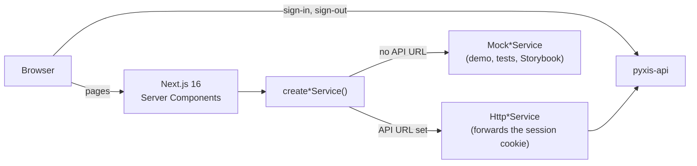

<div align="center">

<picture>
  <source media="(prefers-color-scheme: dark)" srcset=".github/assets/cover-dark.png">
  
</picture>

**The dashboard of Pyxis: the overview, funnels, features, request errors, devices, acquisition and
per-person timelines of a product, measured without cookies or personal data.**

[](https://github.com/samuelcsantana/pyxis-web/actions/workflows/ci.yml)
[](https://codecov.io/gh/samuelcsantana/pyxis-web)
[](https://github.com/samuelcsantana/pyxis-web/actions/workflows/codeql.yml)
<br>
[](LICENSE)
[](tsconfig.json)
[](https://www.conventionalcommits.org)
[](e2e)

</div>

> **Status:** early development. The app skeleton, the design tokens, Storybook and every quality
> gate are in place; sign-in and the first screens are next (see [Roadmap](#roadmap)).

## Ecosystem

| Repository                                               | Role                                                         |
| -------------------------------------------------------- | ------------------------------------------------------------ |
| [pyxis-api](https://github.com/samuelcsantana/pyxis-api) | Ingestion, dashboard sign-in and queries, erasure, retention |
| [pyxis-sdk](https://github.com/samuelcsantana/pyxis-sdk) | Browser tracker published to npm as `pyxis-analytics`        |
| **pyxis-web** (this one)                                 | The dashboard                                                |

## Why it exists

A product team wants to know which features are used, where requests fail, where a sign-up funnel
loses people and what one person did, in order. Pyxis answers those questions from events that
carry no cookie, no IP address and no personal data. This dashboard is where the answers are read:
one admin, one email code to sign in, and a design that puts the number that matters first.

## Features

Shipping now:

- The approved brand and design tokens (light and dark), exposed to Tailwind CSS 4
- A strict Content Security Policy and hardening headers on every page
- Storybook with the design tokens page; every story is also an automated accessibility test
- Sign-in with a six-digit code sent by email; the page never tells whether an email can sign in
- The app shell: sidebar with the screens, project switcher, period selector (today, 7 days,
  30 days or a custom range, kept in the URL), light and dark themes, sign-out, and a menu button
  on phones
- The overview: visits, identified users, conversions and the write error rate, each with its
  change against the previous period and a sparkline; page views and named events per day as a
  chart or a table; the top pages and events. Every percentage sits next to the totals it comes
  from, and a division by zero shows a dash, never `NaN%`
- Devices: device type, browser and operating system as donuts whose legend is a table of every
  value with its visits and share, conversion by device, and the countries by name
- Acquisition: paid visits and the top channel with their share of every visit, visits per day
  stacked by channel (chart or table), and the sources with their conversion rate and the visits
  that came from an ad click
- Features: the most used events and the most visited screens, with count, visits, a daily trend
  and the share of the ranking; a search by name that lives in the URL
- Loading, empty and error states shared by every screen; an empty period shows how to install
  the SDK
- A demo mode with invented data and a visible banner when no API is configured

Planned (see [Roadmap](#roadmap)):

- Requests (success and error rates per route, the screens they come from)
- Funnels with an editor, saved in the URL
- Timelines of a person or a visit
- A live demo with invented data, no sign-in and no real API

## Architecture



Pages read data on the server through service interfaces; the browser calls the API only to sign
in and out ([ADR 0002](docs/adr/0002-server-components-and-services.md)).

## Tech stack

Next.js 16 (App Router) · React 19 · TypeScript 6 (strict) · Tailwind CSS 4 · Geist through
`next/font` · Zod for API answers · [rx-state-bridge](https://github.com/samuelcsantana/rx-state-bridge)
with RxJS for the few requests a Client Component starts · Recharts 3 for the charts, each with a table
view ([ADR 0005](docs/adr/0005-charts-with-recharts-and-a-table-view.md)) · Vitest
and Testing Library · Playwright with axe-core · Storybook 10 · Vercel · GitHub Actions with
CodeQL, Dependabot, Codecov and release-please.

## Getting started

Requirements: Node.js 24 and npm 11.

```bash
git clone git@github.com:samuelcsantana/pyxis-web.git
cd pyxis-web
npm ci
npm run dev          # http://localhost:3000
npm run storybook    # http://localhost:6006
```

| Variable                    | Meaning                                                                  |
| --------------------------- | ------------------------------------------------------------------------ |
| `NEXT_PUBLIC_PYXIS_API_URL` | The Pyxis API. Unset: Mock services with invented data and a demo banner |

Without the variable the dashboard runs in demo mode: no session is asked for, and the sign-in
page accepts the code `000000`.

To sign in against a real API, start the [pyxis-api](https://github.com/samuelcsantana/pyxis-api)
compose stack (it accepts sign-in calls from `http://localhost:3000`), grant yourself a project
with its `admin:grant` script, then run the dashboard on port 3000 exactly:

```bash
NEXT_PUBLIC_PYXIS_API_URL=http://localhost:3040 npx next dev -p 3000
```

Outside production the API logs the sign-in code instead of emailing it
(`docker compose logs api`). The session cookie is set by the API for `localhost`, and cookies
ignore ports, so the dashboard's server receives it and forwards it to the API.

### Routes

| Route                      | What it shows                                                            |
| -------------------------- | ------------------------------------------------------------------------ |
| `/`                        | Opens the first project the admin may read, or explains there is none    |
| `/sign-in`                 | Email, then code; `?expired=1` explains that the session ended           |
| `/[projectId]/overview`    | The overview of a project; `?range=today\|7d\|30d` or `?from=…&to=…`     |
| `/[projectId]/devices`     | Device types, browsers, systems, conversion by device and countries      |
| `/[projectId]/acquisition` | Visits by channel per day, paid visits, the sources and their conversion |
| `/[projectId]/features`    | Events (or `?kind=screens`) ranked by use; `?q=` searches by name        |

`src/proxy.ts` sends a visitor without a session cookie to `/sign-in`; the API still decides
whether the session is valid, and a rejected one lands on `/sign-in?expired=1`.

### Contract

`contract/openapi.json` is a copy of the API's published contract. `npm run contract:sync`
refreshes it; a unit test checks that the demo answers and the bodies the sign-in form sends
match it, and a daily workflow runs that test against the API's `main`.

## Testing

```bash
npm run test:cov        # unit tests in jsdom, 100% coverage required
npm run test:e2e        # Playwright with axe, light and dark, desktop and phone
npm run test:storybook  # every story in headless Chromium, axe violations fail the run
npm run test:tooling    # the lint rule and the comment check
```

Coverage must stay at **100% of statements, branches, functions and lines** of `src/`; CI fails
below it. Excluded, and why:

| Excluded                    | Reason                                                  |
| --------------------------- | ------------------------------------------------------- |
| `src/**/*.stories.tsx`      | Documentation, run as browser tests by `test:storybook` |
| `eslint-rules/`, `scripts/` | Tooling outside `src/`, tested on Node's test runner    |

The root layout is covered too: its test calls the server component and checks the document it
returns.

## Project structure

```text
src/
├── app/            routes, the root layout, design tokens (globals.css), icons
├── components/     UI components, each with its stories (overview, shell, sign-in, states, theme)
├── design/         the design tokens page
├── domain/         pure types and rules: the admin and projects, periods, overview figures,
│                   rates and changes, sparklines, device and country labels, donuts,
│                   channels and sources, feature ranking and search, errors
├── lib/            API configuration, theme, security headers, the current admin
├── services/       one interface per API area, with Http and Mock implementations
└── proxy.ts        sends a visitor without a session to sign in
contract/           the API contract copied from pyxis-api
e2e/                Playwright specs and the axe helper
.storybook/         Storybook configuration
eslint-rules/       the local no-comments ESLint rule
scripts/            the comment check for files ESLint does not read
docs/adr/           architecture decision records
```

## Privacy and security

- Content Security Policy without nonces, so pages stay prerendered: scripts, styles, images and
  fonts from this origin only, connections only to this origin and the Pyxis API, no plugins, no
  framing
- No secret in the browser bundle; data is read on the server
- The session is an `HttpOnly` cookie set by the API; the dashboard's JavaScript never reads it.
  The only cookie the dashboard writes is `pyxis_theme`, the light or dark choice, which the root
  layout reads so the first paint has the right theme (so every page renders on request)
- The sign-in screen says the same thing for every email, like the API it calls
- The live demo has no API configured at all, so it cannot reach real data
- Vulnerabilities: see [SECURITY.md](SECURITY.md)

## Architecture decisions

| ADR                                                                | Decision                                                |
| ------------------------------------------------------------------ | ------------------------------------------------------- |
| [0001](docs/adr/0001-record-architecture-decisions.md)             | Record architecture decisions                           |
| [0002](docs/adr/0002-server-components-and-services.md)            | Server Components reading through service interfaces    |
| [0003](docs/adr/0003-csp-without-nonces.md)                        | A Content Security Policy without nonces                |
| [0004](docs/adr/0004-client-request-state-with-rx-state-bridge.md) | Request state of Client Components with rx-state-bridge |
| [0005](docs/adr/0005-charts-with-recharts-and-a-table-view.md)     | Charts with Recharts, each with a table view            |

## Roadmap

- [x] App skeleton, design tokens, Storybook, quality gates
- [x] Sign-in, app shell, project and period selectors, loading, empty and error states
- [x] Overview
- [x] Devices
- [x] Acquisition
- [x] Features
- [ ] Requests
- [ ] Funnel
- [ ] Timeline
- [ ] Production domain
- [ ] Live demo with invented data

## Contributing and license

See [CONTRIBUTING.md](CONTRIBUTING.md) and the [Code of Conduct](CODE_OF_CONDUCT.md). Released
under the [MIT License](LICENSE).
